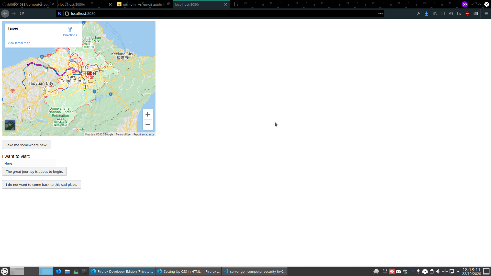
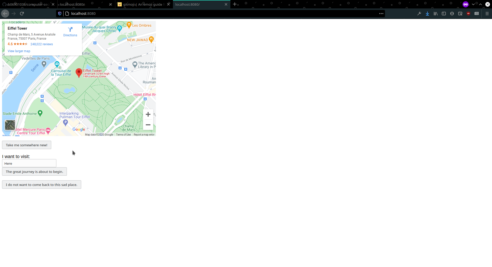
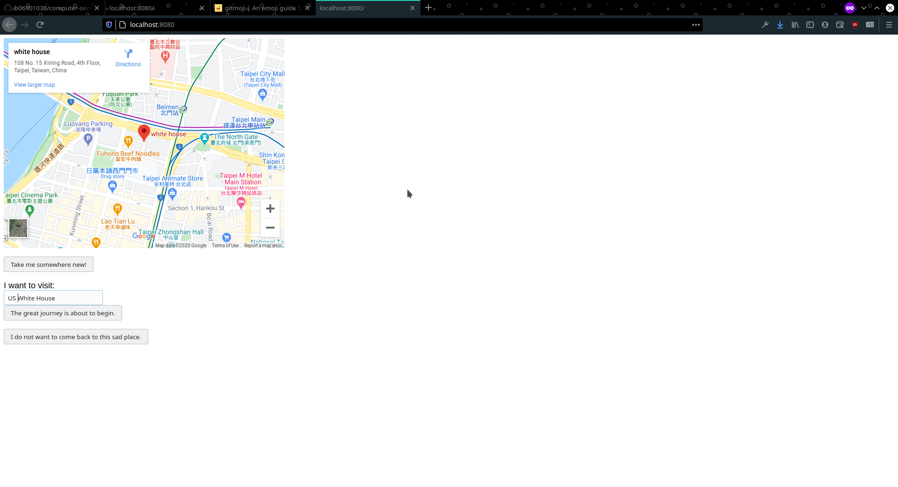
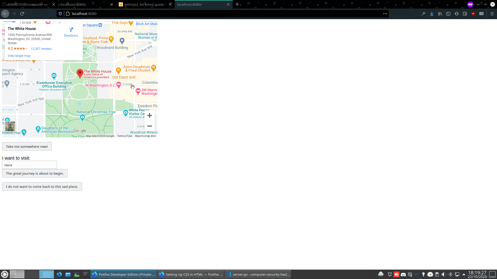
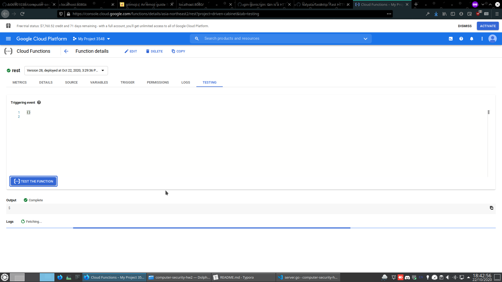

# Cloud Server

### Here are some screenshots on GUI











---

### Some explainations:

#### About this program

The program is written in Google GO. Packages used include [Gin](https://github.com/gin-gonic/gin), [FastHttp](https://github.com/valyala/fasthttp) and GO’s standard library. 

-   ##### Local

    -   All files are in server/ folder

    -   Code runs locally

    -   The program is intended to be run in a US Army General’s office, that will connect to a government database.

    -   server/server.go contains the client, that you’ll get to run, showing the interface in the first 4 screenshots. As the program depends on Google Cloud Platform, please provide the API key as the usage.

    -   Usage:

    -   ```shell
        cd server; go run . $(GOOGLE_API_KEY)
        # GOOGLE_API_KEY is the key issued by google for your billing
        ```

-   ##### Cloud

    -   All files are in secret/ folder
    -   Code runs on Google Cloud Function
    -   The program emulates a secret government database, that stores locations where the US Army will strike next.
    -   server/handler.go is the entry point, reads from the request and issues a response.
    -   server/process.go does the processing of json values.

#### Why it looks so ugly

I’m too lazy to design a sophisticated interface. Simply apply CSS if you want (Modify 1-2 lines in server/templates/page.tmpl and server/server.go)

#### Client: There are 3 buttons

#### - Take me to somewhere new!

This button corresponds to **GET** method. What it does is lookup all places that has been visited, and fetch a random one suitable for attack (remember the program is for US Generals!)

#### - The greate journey is about to begin.

This button corresponds to **PUT** method. It uploads the content in the form box and stores it remotely in Google Servers.

#### - I do not want to come back to this sad place.

This button corresponds to **DELETE** method. It deletes the current location. Maybe the place has been conquered or is no longer worthy of your attention.

#### Server: One URL

Testing is not that convenient on Google Cloud Function. The testing output only shows json string content, without considering the http method. Hence all my request use the **GET** method to contact the server, with custom commands performed with json keys.

#### Some complaints

1.  Google Cloud Function is difficult to debug. Its logs are hidden somewhere in layers of APIs. Could not easily find them.
2.  I used buttons and redirects to handle button clicks. However, I at first didn’t realize that browsers cached the redirected address if I used status code 308 (permanently redirect) instead of status code 307 (temporarily redirect). This led to subtle bugs in that it only works on the first click, and the ones where queries are different.

#### Verdict

After all I don’t think Google Cloud Function is that easy to use. I would prefer to use Google Cloud Engine with GO language Gin as my server, if not for the requirements that we use Google Cloud Function. With that said, it’s pretty decent in its cost efficiency (I’ve tested the amount of money spent with my custom Gin server, GCF is much cheaper).
